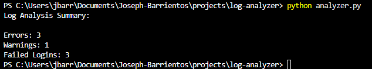

# Log Analyzer

## Overview

I built this project to analyze log files and pull out important events like errors, warnings, and failed login attempts. It reads through a log file and summarizes key information.

This helped me practice working with files, parsing data, and thinking more about security-related events.

---

## Features

* Reads and processes log files
* Counts errors, warnings, and failed logins
* Outputs a summary in the terminal
* Saves results to a file

---

## Technologies Used

* Python

---

## How It Works

The script reads a log file line by line and looks for specific keywords like "ERROR", "WARNING", and "FAILED LOGIN". It counts how many times each appears and prints a summary.

---

## How to Run

In Terminal:

python analyzer.py

---

## Example Output

*Example summary of log activity.*

---

## Notes

* Uses a sample log file for testing
* Can be modified to work with real system logs

---

## Improvements

* Add support for different log formats
* Detect suspicious patterns (i.e. repeated login attempts)
* Export results to CSV
* Add timestamps filtering

