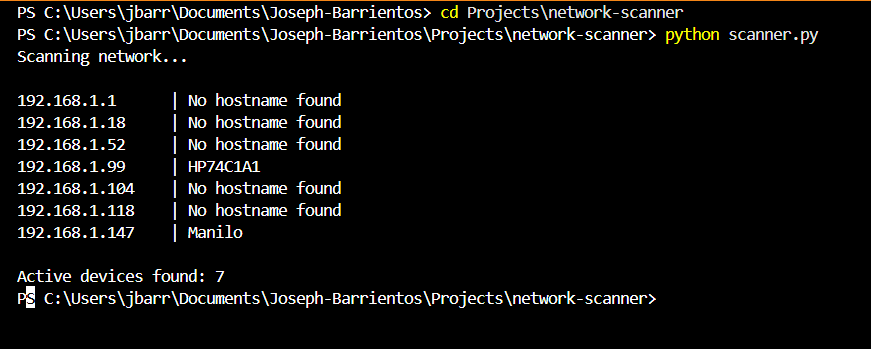

# Network Scanner

## Overview

I built this project to scan a local network and find active devices. It sends ping requests to each IP in a subnet and checks which ones respond. It also tries to pull hostnames when possible.

This was a good way for me to practice networking fundamentals while getting more comfortable with Python.

---

## Features

* Scans a subnet for active devices
* Attempts to resolve hostnames
* Displays output in the terminal
* Shows total number of active devices

---

## Technologies Used

* Python
* os
* socket

---

## How It Works

The script loops through a range of IP addresses (ex. 192.168.1.1–254) and sends a ping to each one.

If a device responds, it gets marked as active. The script then tries to resolve the hostname.

---

## How to Run

Clone the repo and run the script:

python scanner.py

---

## Example Output

---

## Notes

* Hostnames don’t always resolve depending on the network
* Public WiFi usually blocks most results
* Results may vary based on firewall and network settings

---

## What I’d Improve

* Add port scanning
* Add multithreading
* Let the user input a subnet
* Export results to a file
* Make it work across different operating systems

---

## Resume

[View My Resume](../../docs/joseph_barrientos_resume.pdf)

