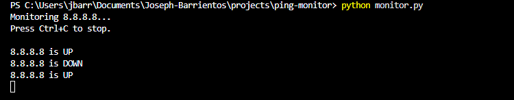

# Ping Monitor

## Overview
I built this project to monitor whether a device is up or down in real time. It continuously sends ping requests and logs any status changes.

## Features
- Monitors a target IP continuously  
- Logs status changes (UP/DOWN)  
- Timestamped  
- Simple and reliable  

## How It Works
The script pings a target every few seconds. If the status changes, it logs the event with a timestamp.

## How to Run
python monitor.py

## Notes
- Uses 8.8.8.8 (Google DNS) as a reliable test target  
- Can be changed to monitor any device  

## Example Output

I turned off the Wi-Fi temporarily for testing.

## How it can be improved
- Monitor multiple devices  
- Add alerts (sound/email)  
- Export logs to CSV  
